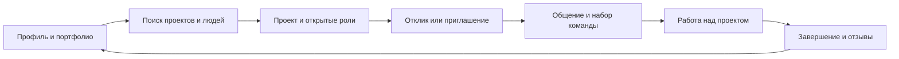
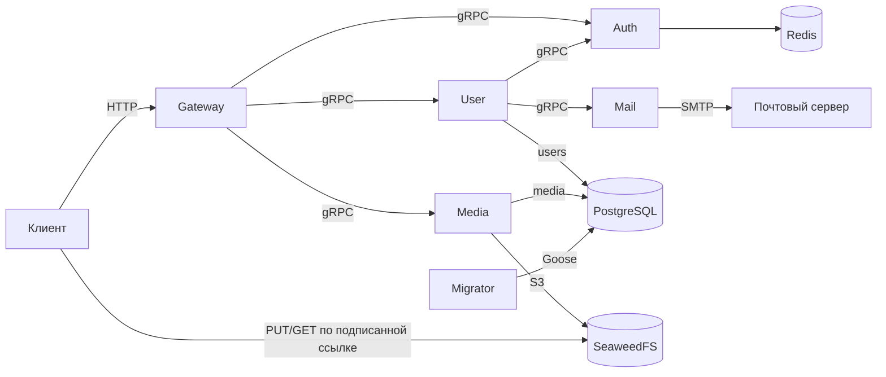

# MatchLab Backend

MatchLab помогает студентам, исследователям и другим специалистам находить научные и практические проекты, собирать команды и подтверждать опыт совместной работы. Инициатор публикует задачу и открытые роли; потенциальный участник находит подходящий проект или получает приглашение, показывает навыки и портфолио, общается с командой и присоединяется к работе. После завершения проекта участники могут оставить друг другу отзывы. Бэкенд должен поддерживать весь этот путь — от поиска до подтверждённой репутации.

Этот README описывает **целевой продукт по макетам дизайна**. Реализованная часть API приведена отдельно ниже: учётные записи, сеансы, подтверждение почты и загрузка публичных и приватных файлов.

## Продуктовые сценарии

1. **Найти возможности и людей.** Лента показывает проекты и коллабораторов по интересам пользователя. Можно искать проекты по тексту, типу (научный или практический), сфере, срокам и ключевым словам; людей — по навыкам, интересам, вузу, готовности к сотрудничеству и признакам подтверждённого опыта. В макетах есть показатель совпадения кандидата с ролью, но его алгоритм пока не определён.
2. **Представить свой опыт.** Профиль содержит сведения о человеке, образование, интересы, навыки, портфолио, публикации и отзывы. К работе можно добавить ссылку и подтверждающие материалы; интерфейс различает работы, отправленные на проверку, подтверждённые и требующие доказательств. Проверка профиля и работ должна повышать доверие к ним, не скрывая неподтверждённые материалы без отдельного правила продукта.
3. **Создать проект и набрать команду.** Инициатор описывает проблему и цель, указывает сферу, теги, сроки и роли с нужными навыками. После публикации проект становится доступен для поиска и откликов. Кандидат откликается на конкретную роль; инициатор просматривает отклики и профиль кандидата, управляет занятыми и свободными ролями и может приглашать коллабораторов.
4. **Работать вместе и завершить проект.** У инициатора есть управление жизненным циклом проекта: поиск соавторов, начало работы, снятие с публикации, редактирование, завершение или отмена. Участник видит свои проекты и роль в них, может покинуть проект. Чаты помогают обсудить отклик, приглашение и работу. После завершения участники и инициатор получают возможность оставить отзыв о совместной работе.
5. **Сохранять доверие и контроль.** Пользователь может жаловаться на профиль или переписку, прикладывать доказательства, блокировать другого пользователя и обращаться в поддержку. Настройки приватности управляют видимостью проектов и контактов; предусмотрены список заблокированных людей и выгрузка копии профиля и портфолио.



Макеты задают пользовательские сценарии и основные сущности, но не фиксируют все правила API. Например, ещё нужно определить расчёт рекомендаций и процента совпадения, порядок проверки профилей и работ, права при разных состояниях проекта, обработку приглашений и точные последствия блокировки. Эти решения следует закрепить в контрактах и тестах при реализации соответствующих функций.

В целевой модели профиль объединяет навыки, интересы, образование, работы и настройки видимости; проект связывает инициатора, описание задачи, сроки и роли с требованиями к участникам. Отклик и приглашение относятся к конкретному проекту или роли, а принятый участник входит в команду. Чаты сопровождают взаимодействие, отзывы привязаны к завершённым проектам, жалобы и проверки материалов образуют отдельный контур доверия. Это логические области продукта, а не заранее выбранная схема будущих сервисов.

## Что уже есть в репозитории

| Сервис | Реализованная задача | Подробности |
| --- | --- | --- |
| Gateway | Публичный HTTP API для учётных записей, сеансов, почты и файлов; обращение к внутренним сервисам по gRPC. | [README Gateway](cmd/gateway/README.md) |
| User | Учётные записи, вход по email и паролю с обязательным подтверждением почты, запрос и подтверждение адреса электронной почты. Данные принадлежат схеме PostgreSQL `users`. | [README User](cmd/user/README.md) |
| Auth | Создание, проверка и отзыв краткосрочных сеансов в Redis. | [README Auth](cmd/auth/README.md) |
| Mail | Синхронная отправка писем через настроенный SMTP-сервер. Собственного хранилища нет. | [README Mail](cmd/mail/README.md) |
| Media | Внутренний gRPC API для загрузки, подтверждения и скачивания публичных и приватных файлов через S3; метаданные в PostgreSQL `media`. HTTP-маршруты доступны через Gateway. | [README Media](cmd/media/README.md) |
| Migrator | Одноразовая джоба Goose: применяет миграции PostgreSQL и завершается. | [README Migrator](cmd/migrator/README.md) |

Поиск, проекты, роли, отклики, приглашения, профили и портфолио, чаты, отзывы, модерация и настройки приватности профиля пока представлены в дизайне, но не реализованы в API этого репозитория. Таблица выше описывает существующие сервисы; она не предписывает выделять каждую будущую функцию в отдельный микросервис.

## Техническая основа и запуск

Go-код находится в `internal`, точки входа и настройки сервисов — в `cmd/<service>`, внутренние gRPC-контракты — в [`api/proto`](api/proto), описание публичного HTTP API с примерами — в [`api/http`](api/http/README.md). Клиент обращается к Gateway по HTTP; Gateway вызывает User, Auth и Media по gRPC. User обращается к Auth для создания сеанса и к Mail для отправки письма. PostgreSQL хранит данные User и метаданные Media; Redis хранит сеансы. Media выдаёт подписанные ссылки на объекты S3, проверяет публичность и владельца, подтверждает загрузку; HTTP-маршруты файлов доступны через Gateway. Mail передаёт письмо SMTP-серверу и ждёт подтверждения приёма. Общие проверки работоспособности находятся в [`pkg/healthcheck`](pkg/healthcheck/README.md).



Для локального запуска нужны Docker и Docker Compose:

```sh
docker compose up --build
```

HTTP API будет доступен по адресу `http://localhost:8080`, интерактивная документация Scalar — по адресу `http://localhost:8084`, тестовые письма — в Mailpit по адресу `http://localhost:8025`. Локальное S3-совместимое хранилище SeaweedFS доступно по адресу `http://localhost:8333`, его Admin UI — по адресу `http://localhost:12646`; bucket и CORS настраивает отдельная идемпотентная джоба [`seaweedfs-init`](compose/seaweedfs/README.md). Запуск можно проверить запросом `GET http://localhost:8080/health`; остановить контейнеры — командой `docker compose down`. PostgreSQL и SeaweedFS сохраняют данные в именованных томах, а Redis работает без постоянного тома: после его пересоздания требуется повторный вход. Пароли и ключи по умолчанию в Compose предназначены только для локальной разработки.

Подтверждение почты разрешено только для активных доменов организаций. Для локальной проверки HSE добавьте тестовые правила явным скриптом, как описано в [README User](cmd/user/README.md); без правил запросы подтверждения отклоняются.

Сервисы читают несекретную конфигурацию из YAML (по умолчанию `/etc/app/config.yaml`, путь меняется флагом `-config`), а секреты — из переменных окружения. В Compose джоба Migrator применяет миграции Goose до запуска User и Media; Media также ждёт `seaweedfs-init`. Его gRPC доступен локально на `localhost:8085`. Migrator можно повторно запустить командой `docker compose run --rm migrator`; уже применённые миграции повторно не выполняются. Проверка кода: `go test ./...`; CI дополнительно запускает интеграционные тесты с контейнерами и измеряет покрытие. Команды отдельного запуска и текущие API описаны в README сервисов.

Развёртывание в k3s и GitOps-конфигурация находятся в отдельном инфраструктурном репозитории. ClickHouse рассматривается для будущей аналитики; текущие сервисы его не используют.

## Работа с файлами

Gateway предоставляет подготовку загрузки, подтверждение, метаданные, ссылку на скачивание и multipart-загрузку с докачкой. Владелец берётся из сеанса. Публичный файл можно читать без входа; приватный — только владельцу. Подтверждение и все операции multipart всегда требуют владельца и подтверждённой почты.

Клиент получает PUT-ссылку через `POST /api/v1/media/files`, отправляет байты прямо в S3 и вызывает `POST /api/v1/media/files/{id}/complete`. После перехода в `ready` он запрашивает GET-ссылку через `/download-url`. Локально PUT действует 10 минут, GET — 5 минут. Bucket закрыт; публичность проверяет Media перед выдачей подписанной ссылки. Полный пример — в [README HTTP API](api/http/README.md).

Если версия миграций уже `2`, но в `media.file` нет `is_public`, выполните описанное в [README Migrator](cmd/migrator/README.md) добавление колонки без удаления данных. Пересборка старой миграции не применяет её повторно.

Для загрузки частями создайте сессию через `POST /api/v1/media/files/multipart`,
получите ссылки в `/{id}/multipart/part-urls`, отправьте части напрямую в S3 и
передайте их номера и ETag в `/{id}/multipart/complete`. Прогресс доступен через
`GET /{id}/multipart`, отмена — через `DELETE /{id}/multipart`. По умолчанию части
по 8 МиБ, срок сессии 24 часа, общий лимит файла 100 МиБ. Пример PowerShell и
докачка описаны в [README HTTP API](api/http/README.md#загрузка-файла-частями-с-докачкой).
Перед запуском обновлённого Media примените новую миграцию:
`docker compose run --rm --build migrator`, затем пересоберите Gateway, Media и Scalar.

## Обновление и тесты

После изменения кода и спецификации обновите контейнеры:

```sh
docker compose up -d --build gateway media api-docs
```

`openapi.yaml` копируется в образ api-docs при сборке; простой restart не обновляет его. Откройте Scalar по `http://localhost:8084` и обновите страницу. Если сервис запускается через `go run` или IDE, перезапустите его процесс.

Из корня проекта:

```sh
go test ./...
go test -tags=integration -count=1 ./...
go test -tags=integration -count=1 -v ./internal/migrator/migrations
go test -v ./internal/gateway/delivery/http -run '^TestMediaRoutes$'
```

Вторая команда включает интеграционные проверки и требует Docker. Они создают отдельные тестовые контейнеры и не используют БД Compose. `-count=1` отключает кеш результата, `-v` показывает сценарии, `-run` выбирает тест. Настройка сокета Docker Desktop для Windows описана в [README Media](cmd/media/README.md).
